## 1. High-Level Application Architecture

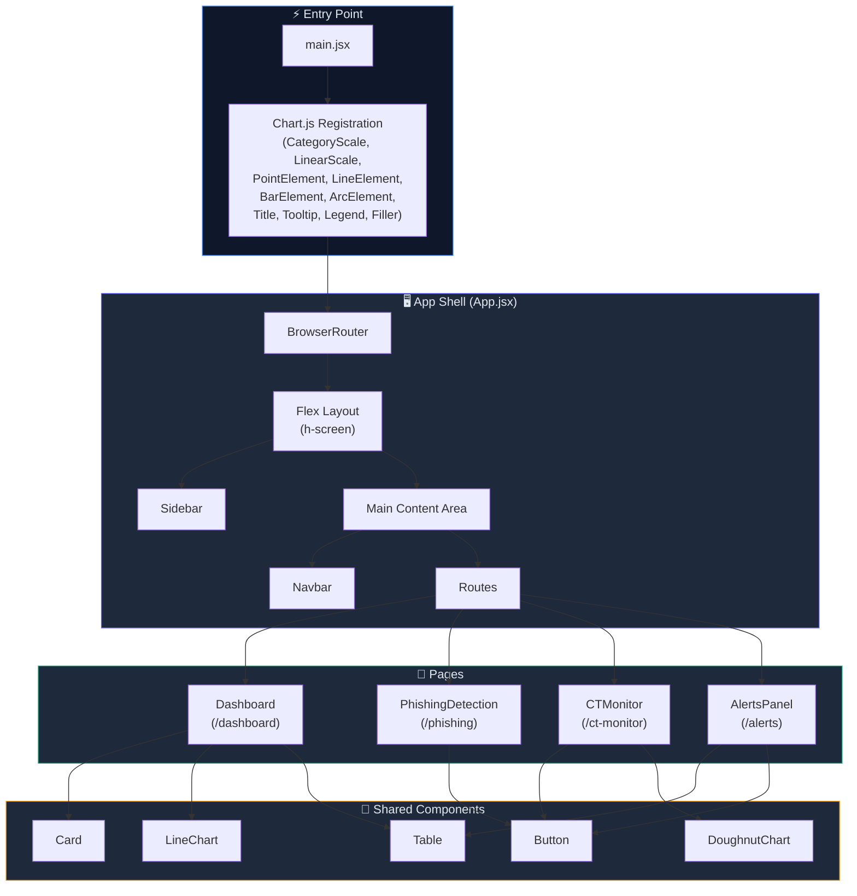

---

## 2. Routing & Navigation Flow

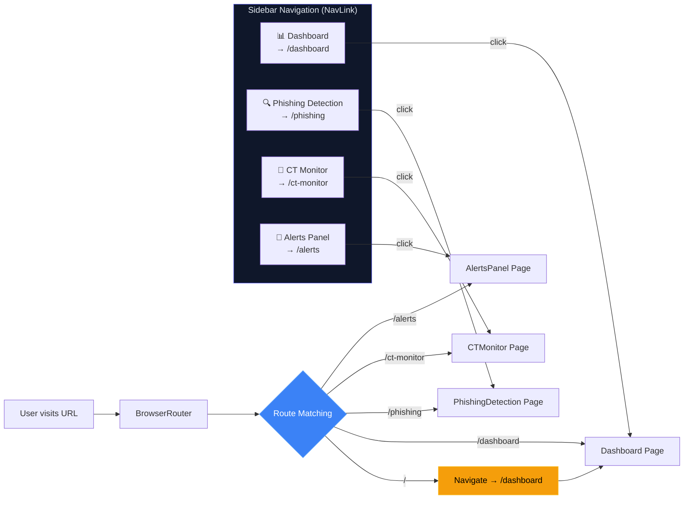

---

## 3. Component Hierarchy Tree

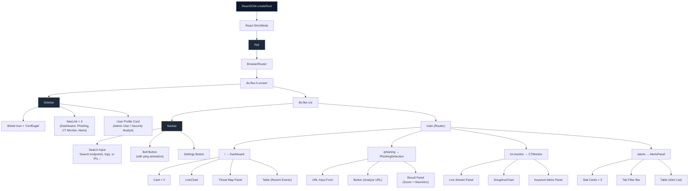

---

## 4. Dashboard Page — Data Flow

```mermaid
flowchart TD
    subgraph StatsFlow["📊 Stats Cards"]
        statsArray["stats array\n(4 objects)"]
        statsMap["stats.map()"]
        cardRender["Card Component\n• title, value\n• icon (Lucide)\n• trend direction\n• gradient color"]
    end

    subgraph ChartFlow["📈 Line Chart"]
        trafficData["trafficData object"]
        labels["labels:\n00:00 → 24:00\n(4h intervals)"]
        ds1["Dataset 1: Threat Intensity\nred line, filled area"]
        ds2["Dataset 2: Certificates Logged\nblue line, no fill"]
        lineChartRender["LineChart Component\n(react-chartjs-2)"]
    end

    subgraph ThreatMap["🌍 Threat Map"]
        countryData["Country data array\n(Russia 45%, China 32%,\nBrazil 15%, USA 8%)"]
        progressBars["Progress bar\nper country"]
        geoBtn["'View Geographic Map'\nbutton"]
    end

    subgraph EventsFlow["📋 Recent Events Table"]
        alertsData["recentAlertsData\n(5 alert objects)"]
        tableRender["Table Component\n• Time\n• Domain / Indicator\n• Event Type\n• Severity\n• Actions"]
    end

    statsArray --> statsMap --> cardRender
    trafficData --> labels & ds1 & ds2
    labels & ds1 & ds2 --> lineChartRender
    countryData --> progressBars --> geoBtn
    alertsData --> tableRender

    style StatsFlow fill:#0f172a,stroke:#ef4444,color:#e2e8f0
    style ChartFlow fill:#0f172a,stroke:#3b82f6,color:#e2e8f0
    style ThreatMap fill:#0f172a,stroke:#f59e0b,color:#e2e8f0
    style EventsFlow fill:#0f172a,stroke:#10b981,color:#e2e8f0
```

---

## 5. CT Monitor — Live Stream Flow

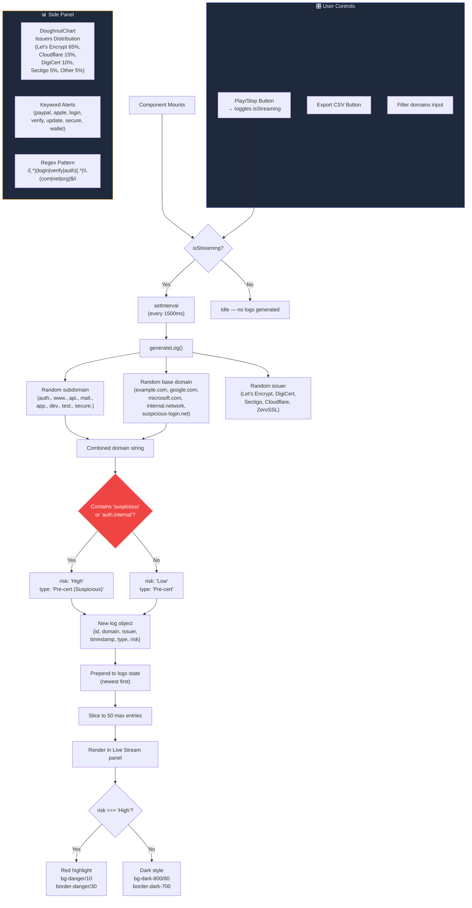

---

## 6. Phishing Detection — Scan Flow

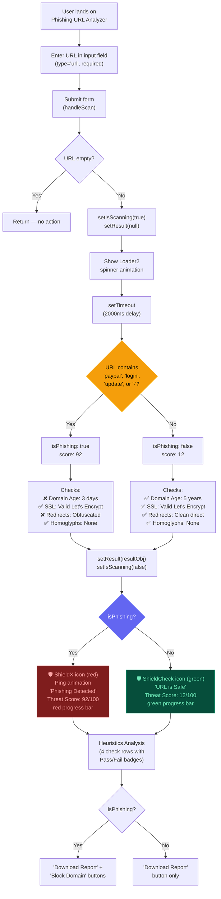

---

## 7. Alerts Panel — Triage Flow

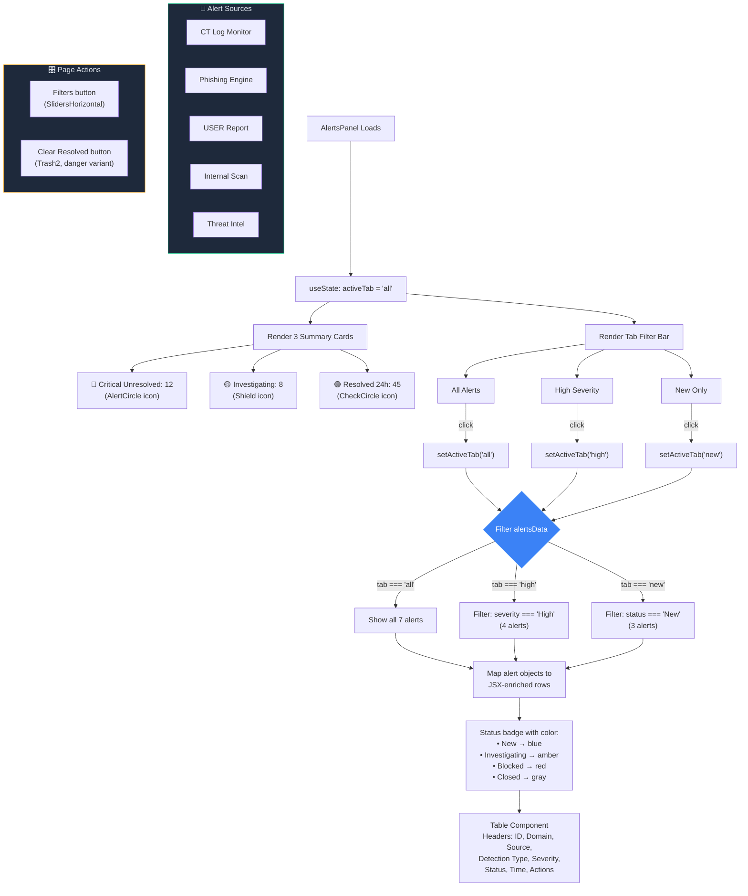

---

## 8. State Management Flow

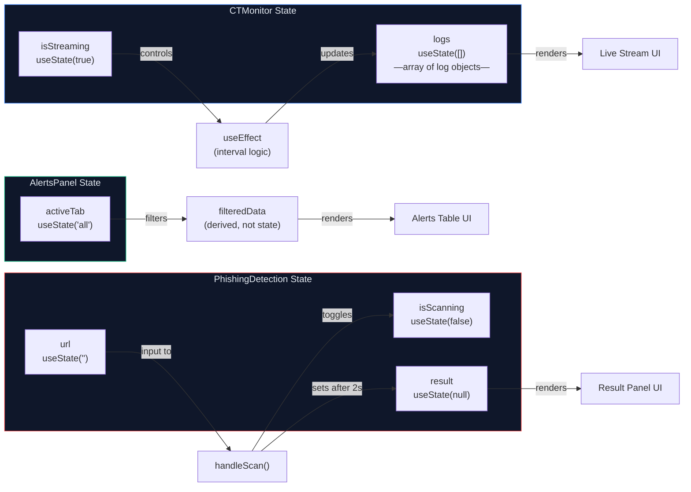

---

## 9. User Interaction Flow — End-to-End Journey

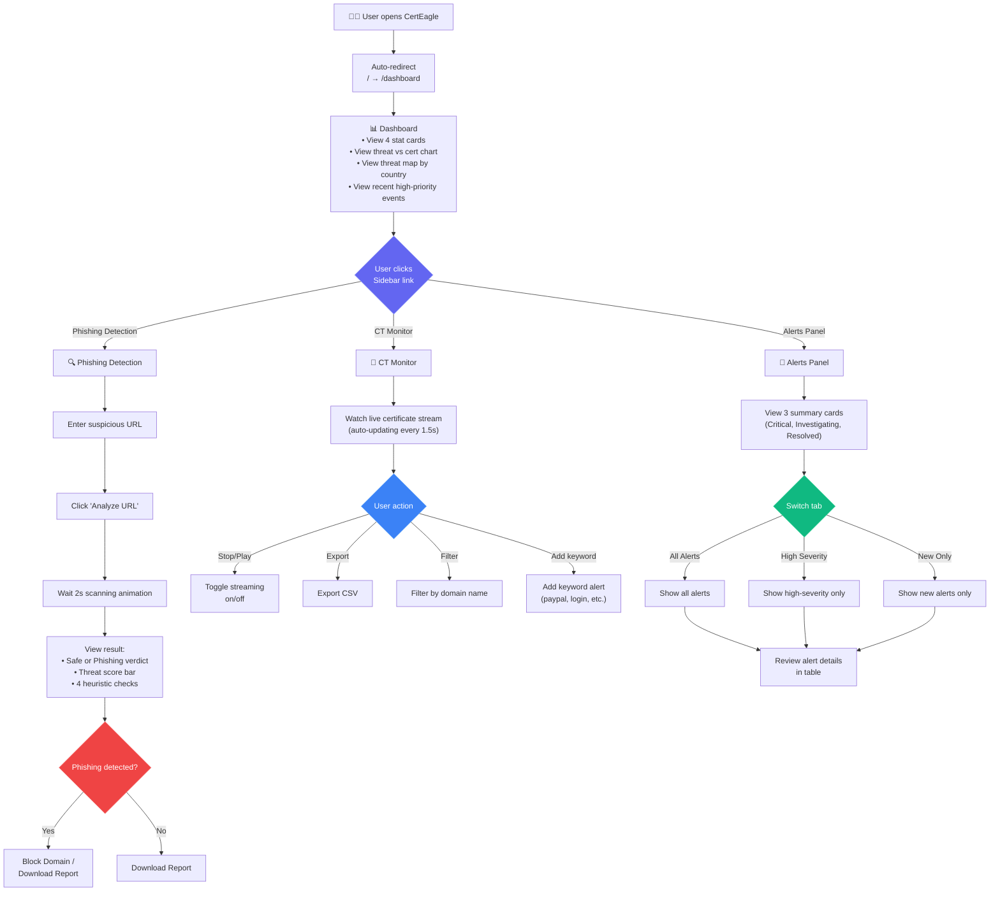

---

## 10. Data Rendering Pipeline

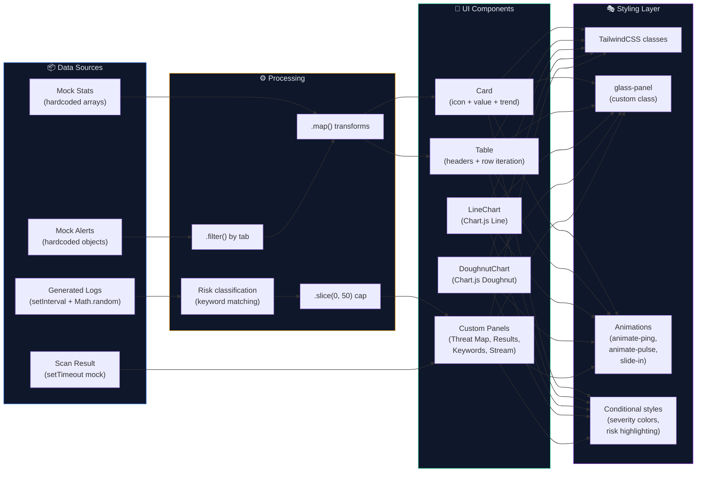

---

## 11. Table Component — Conditional Cell Rendering

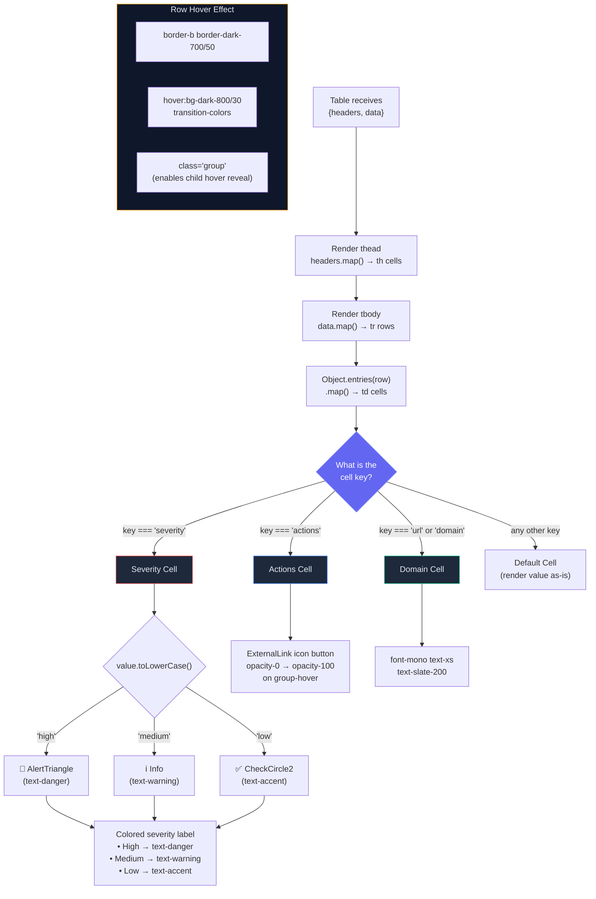

---

## 12. Chart.js Configuration Pipeline

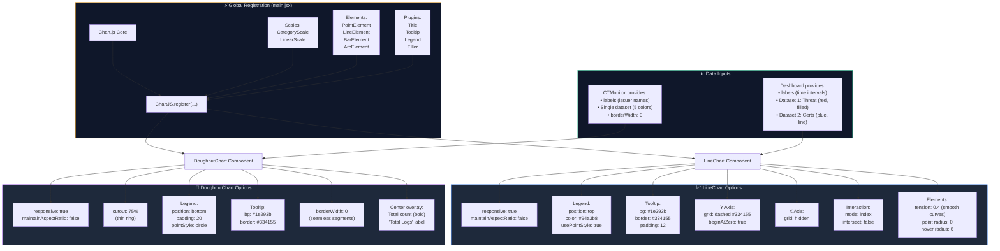

---

## 13. Threat Classification & Severity System

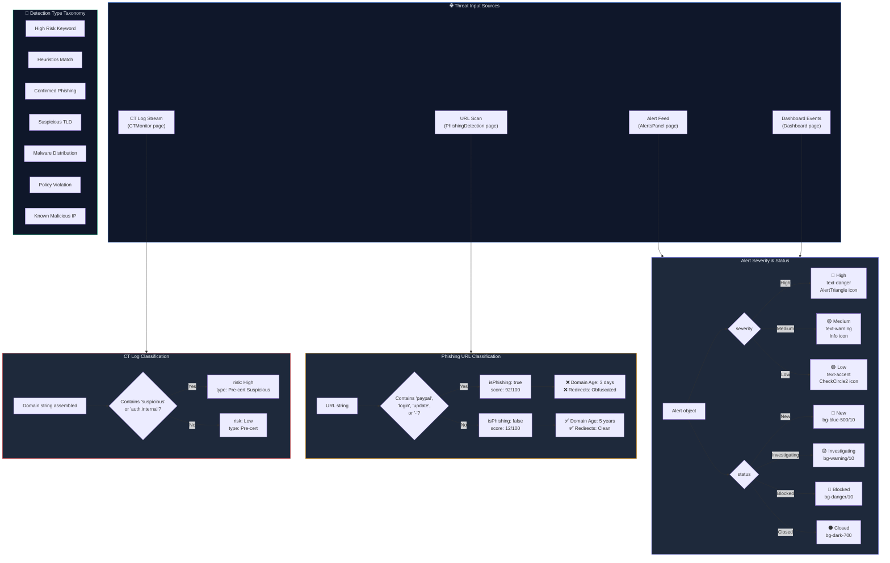

---

## 14. Sidebar Navigation — Active State & UI Feedback

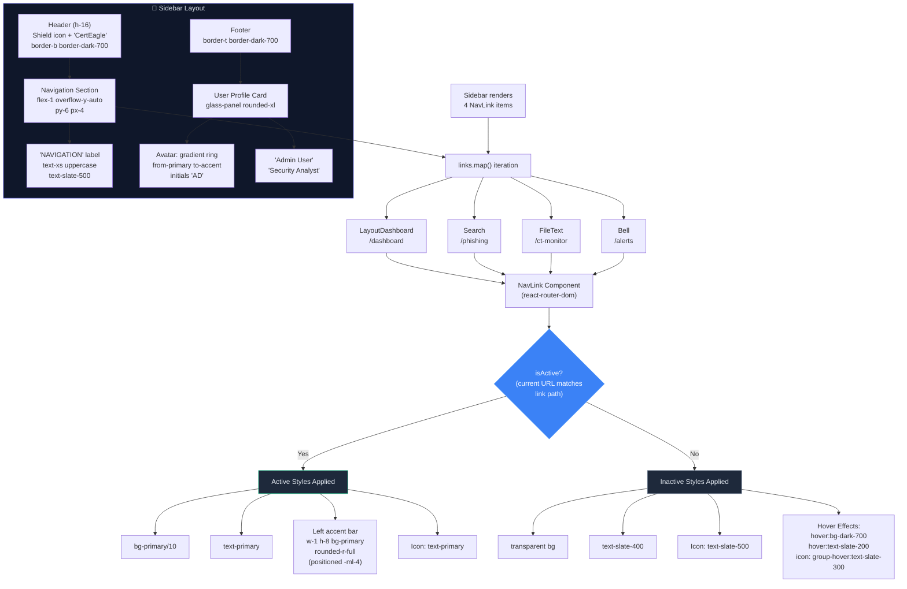

---

## 15. Application Lifecycle & Effect Cleanup

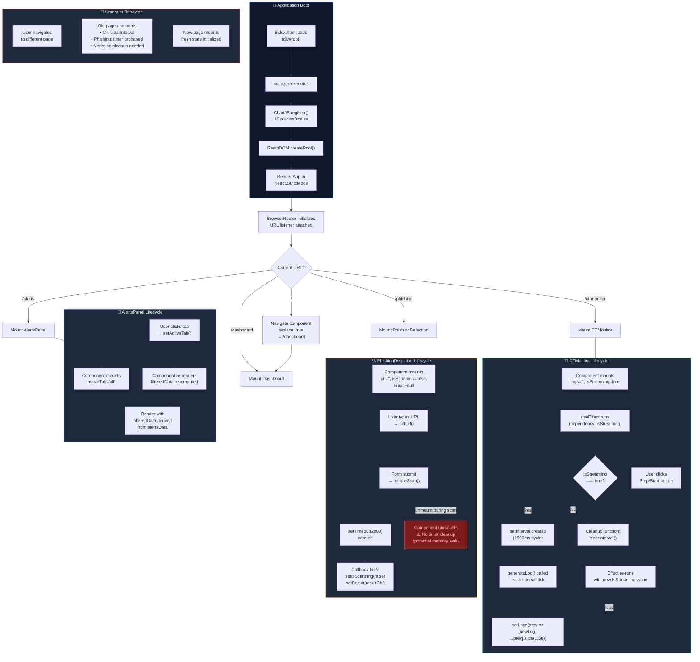
